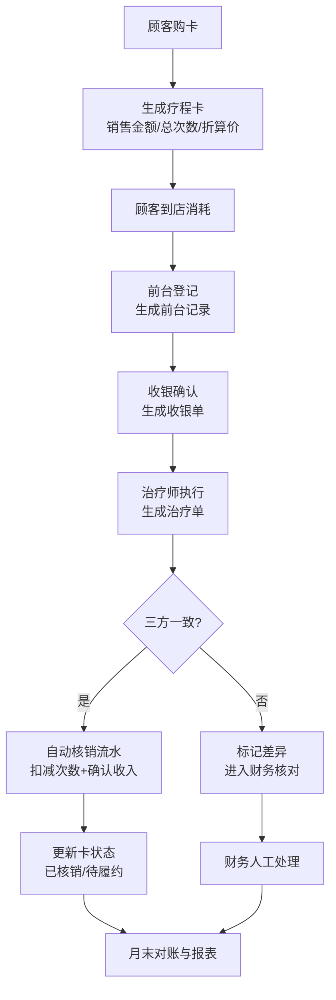

## 1. 产品概述

医美机构疗程卡余额审计后台系统，面向财务人员和院长，强调销售金额、服务次数与履约状态之间的精准对应关系。通过6大核心模块实现售卡统计、收入确认、核销追溯、风险预警、门店对账及报表导出，确保疗程卡不仅是运营工具，更能满足财务合规和内部控制需求。

- **目标用户**：机构财务人员（对账、核销、审计）、院长/总经理（履约压力、经营分析、资源调配）
- **核心价值**：金额-次数-履约的闭环追踪，风险前置预警，财务内控合规

## 2. 核心功能

### 2.1 用户角色

| 角色 | 登录方式 | 核心权限 |
|------|----------|----------|
| 财务人员 | 账号密码登录 | 核销流水核对、收入确认、退款/转卡审批、导出报表 |
| 院长/总经理 | 账号密码登录 | 全模块查看权限、履约压力分析、门店排行、风险卡审核 |

### 2.2 功能模块

1. **卡项总览**：按门店/项目/顾问/日期多维度售卡统计，卡片详情展示
2. **收入确认**：售卡收入与已核销/待履约金额分解，权责发生制视图
3. **核销流水**：顾客消耗记录，前台-收银-治疗单三方一致性核对
4. **风险卡清单**：长期未消费、频繁改卡、手工补扣、负余次、过期核销等异常
5. **门店对账**：各门店售卡、核销、未履约余额汇总，差异比对
6. **导出报表**：未履约余额表、顾问售卡未消耗表、门店核销排行等Excel导出

### 2.3 页面详情

| 页面名称 | 模块名称 | 功能描述 |
|----------|----------|----------|
| 卡项总览 | 统计筛选区 | 门店多选、项目类别、顾问、日期范围筛选器 |
| 卡项总览 | 概览指标卡片 | 售卡总金额、总次数、已核销金额、待履约金额、未服务总次数 |
| 卡项总览 | 售卡明细表 | 卡号、顾客、项目、购买门店、顾问、成交日期、销售金额、赠送次数、总次数、单次折算价、已核销次数、剩余次数、已核销金额、待履约金额、状态 |
| 卡项总览 | 维度统计图 | 按门店售卡数量柱状图、按项目售卡占比饼图 |
| 收入确认 | 收入构成看板 | 预收账款余额、本期确认收入、期末待履约金额 |
| 收入确认 | 收入确认明细 | 按核销进度逐行确认收入的明细表 |
| 收入确认 | 月度趋势图 | 近12个月售卡收入vs确认收入折线对比图 |
| 核销流水 | 筛选与日期核对 | 日期选择、门店、收银员、治疗师筛选 |
| 核销流水 | 流水列表 | 核销单号、顾客、卡号、项目、次数、核销金额、前台、收银单号、治疗师、治疗单号、操作时间、一致性状态 |
| 核销流水 | 差异标记 | 自动比对三方单据并标记异常，点击查看差异详情 |
| 风险卡清单 | 风险分类标签页 | 全部/长期未消费/频繁改卡/手工补扣/负余次/过期核销 |
| 风险卡清单 | 风险列表 | 卡号、风险类型、风险等级、首次发生时间、最近更新、涉及金额、涉及次数、处理状态 |
| 风险卡清单 | 风险详情弹窗 | 完整风险轨迹、操作日志、审批记录、处理建议 |
| 门店对账 | 门店汇总表 | 门店名称、本期售卡金额、本期核销金额、期末未履约余额、期初余额、期末余额、差异额 |
| 门店对账 | 对账明细钻取 | 点击门店进入该店逐笔核对明细 |
| 门店对账 | 履约压力视图 | 按项目维度：剩余次数×单次预计时长=所需工时，与设备/治疗师产能对比 |
| 导出报表 | 报表模板选择 | 未履约余额表、顾问售卡未消耗表、门店核销排行、月度收入确认表、风险卡汇总表 |
| 导出报表 | 筛选条件 | 日期范围、门店、导出格式(xlsx) |
| 导出报表 | 退款转卡审批 | 退款/转卡申请列表，填写审批意见后才可执行 |

## 3. 核心流程

### 3.1 售卡→核销→对账闭环

售卡完成后生成疗程卡记录，顾客到店消耗时前台登记→收银确认→治疗师执行，三方单据齐全后自动形成核销流水，扣减次数并按单次折算价确认收入。每日财务核对流水一致性，月末生成门店对账汇总与未履约余额表。

### 3.2 风险识别与处理

系统后台定时扫描：超过90天未核销标记为长期未消费；30天内改卡≥3次标记为频繁改卡；非系统自动核销的手工操作记录为手工补扣；次数余额<0标记为负余次；核销日期>卡有效期标记为过期核销。风险卡进入清单后由院长审批处理。

### 3.3 退款转卡审批

前台发起退款/转卡申请→填写原因与金额→财务审核→院长审批（超过阈值）→审批通过后系统执行退款/转卡操作，全程记录审批意见留痕。

## 4. 用户界面设计

### 4.1 设计风格

- **主色调**：深青色 `#0F4C5C`（专业、稳重），辅色：琥珀金 `#E36414`（强调、风险）
- **中性色**：采用锌灰(zinc)色系，白底卡片 + 细边框
- **按钮风格**：圆角6px，主按钮渐变填充，hover微上浮阴影
- **字体**：标题使用 Noto Serif SC（衬线，专业感），正文使用 Noto Sans SC
- **布局**：左侧固定侧边栏导航 + 顶部面包屑状态栏 + 主体卡片式内容区
- **图标**：Lucide React 线性图标，统一 18px 尺寸

### 4.2 页面设计概述

| 页面名称 | 模块名称 | UI 元素 |
|----------|----------|---------|
| 通用布局 | 侧边栏导航 | 6个模块图标+文字，选中项左侧青色色条高亮，收缩态仅图标 |
| 通用布局 | 顶部状态栏 | 面包屑、用户角色切换、搜索框、通知铃铛、头像下拉 |
| 卡项总览 | 概览指标 | 5张大数字卡片，金额/次数/履约分别用不同图标与辅色，趋势箭头 |
| 卡项总览 | 明细表格 | 斑马纹行，状态标签用颜色区分（正常-绿，异常-橙，已完成-灰） |
| 收入确认 | 收入看板 | 三大金额模块用不同深浅背景卡片，底部进度条表示履约率 |
| 核销流水 | 差异标记 | 异常行整行浅橙背景，末尾红叉图标，可展开看三方差异详情 |
| 风险卡清单 | 风险等级 | 高风险-红色标签，中风险-橙色，低风险-黄色，带脉动点动画 |
| 门店对账 | 履约压力 | 条形进度条，超过80%产能标红闪烁，配治疗师/设备提示 |
| 导出报表 | 审批弹窗 | 表单式布局，必填项红星标记，审批意见多行文本框 |

### 4.3 响应式设计

- Desktop-first 设计，最小宽度 1280px 正常显示
- 侧边栏在 <1024px 时默认折叠为图标栏
- 表格在小屏可横向滚动，固定前两列（卡号/顾客）
- 顶部搜索框在 <768px 时收起为搜索图标

### 4.4 交互动效

- 页面首次加载：指标卡片从下往上渐入，stagger 100ms
- 表格行 hover：背景色渐变 + 轻微放大左侧选中条
- 风险标签：高风险呼吸灯动画
- 差异展开/收起：平滑高度过渡 250ms
- 弹窗进入：backdrop 渐显 + 内容缩放淡入
