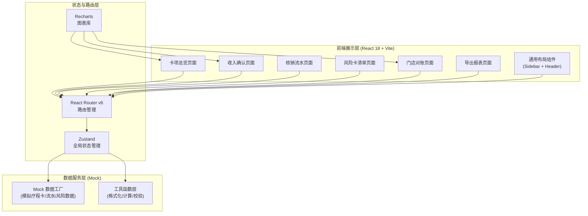
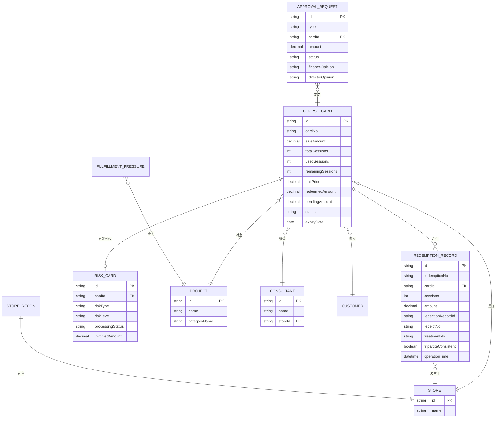

## 1. 架构设计



## 2. 技术描述

- **前端框架**：React 18 + TypeScript 5
- **构建工具**：Vite 5
- **样式方案**：Tailwind CSS 3.4
- **路由管理**：React Router DOM v6
- **状态管理**：Zustand 4
- **图表可视化**：Recharts 2.12
- **图标库**：Lucide React 0.378
- **数据层**：纯前端 Mock 数据（无需后端），使用 localStorage 做简单持久化
- **导出**：SheetJS (xlsx) 0.18 实现 Excel 导出

## 3. 路由定义

| Route 路径 | 页面组件 | 用途 |
|------------|----------|------|
| `/` | `<CardOverview />` | 卡项总览（默认首页） |
| `/revenue` | `<RevenueRecognition />` | 收入确认 |
| `/redemption` | `<RedemptionFlow />` | 核销流水 |
| `/risk` | `<RiskCards />` | 风险卡清单 |
| `/reconciliation` | `<StoreReconciliation />` | 门店对账 |
| `/reports` | `<ReportsExport />` | 导出报表 |

## 4. API 定义（Mock 层接口规范）

### 4.1 类型定义（shared）

```typescript
// 疗程卡类型
interface CourseCard {
  id: string;
  cardNo: string;
  customerName: string;
  customerPhone: string;
  projectId: string;
  projectName: string;
  categoryId: string;
  categoryName: string;
  storeId: string;
  storeName: string;
  consultantId: string;
  consultantName: string;
  saleDate: string;
  saleAmount: number;
  giftedSessions: number;
  paidSessions: number;
  totalSessions: number;
  unitPrice: number;
  usedSessions: number;
  remainingSessions: number;
  redeemedAmount: number;
  pendingAmount: number;
  expiryDate: string;
  status: 'active' | 'completed' | 'expired' | 'abnormal';
  changeCount: number;
  lastRedemptionDate: string | null;
  manualDeductionCount: number;
  hasNegativeBalance: boolean;
  expiredRedeemed: boolean;
}

// 核销流水类型
interface RedemptionRecord {
  id: string;
  redemptionNo: string;
  cardId: string;
  cardNo: string;
  customerName: string;
  projectId: string;
  projectName: string;
  sessions: number;
  amount: number;
  storeId: string;
  storeName: string;
  receptionistId: string;
  receptionistName: string;
  receptionRecordId: string;
  cashierId: string;
  cashierName: string;
  receiptNo: string;
  therapistId: string;
  therapistName: string;
  treatmentNo: string;
  operationTime: string;
  tripartiteConsistent: boolean;
  inconsistencyType?: 'reception' | 'receipt' | 'treatment' | 'amount' | 'multi';
  remark: string;
  isManual: boolean;
}

// 风险卡类型
interface RiskCard {
  id: string;
  cardNo: string;
  customerName: string;
  riskType: 'longIdle' | 'frequentChange' | 'manualDeduction' | 'negativeBalance' | 'expiredRedeemed';
  riskLevel: 'high' | 'medium' | 'low';
  firstOccurDate: string;
  lastUpdateDate: string;
  involvedAmount: number;
  involvedSessions: number;
  processingStatus: 'pending' | 'reviewing' | 'resolved' | 'ignored';
  assignee: string;
  description: string;
  operationLogs: RiskOperationLog[];
}

interface RiskOperationLog {
  id: string;
  operator: string;
  role: string;
  action: string;
  time: string;
  remark: string;
}

// 门店对账类型
interface StoreReconSummary {
  storeId: string;
  storeName: string;
  openingBalance: number;
  currentPeriodSale: number;
  currentPeriodRedeemed: number;
  refundAmount: number;
  transferIn: number;
  transferOut: number;
  theoreticalClosing: number;
  actualClosing: number;
  difference: number;
  pendingSessionsTotal: number;
  pendingAmountTotal: number;
}

// 履约压力类型
interface FulfillmentPressure {
  projectId: string;
  projectName: string;
  remainingSessions: number;
  avgDurationPerSession: number;
  requiredHours: number;
  deviceCapacityHours: number;
  therapistCapacityHours: number;
  pressureRatio: number;
}

// 退款转卡审批
interface ApprovalRequest {
  id: string;
  requestNo: string;
  type: 'refund' | 'transfer';
  cardNo: string;
  customerName: string;
  amount: number;
  sessions: number;
  applicant: string;
  applyTime: string;
  reason: string;
  financeOpinion?: string;
  financeReviewer?: string;
  financeTime?: string;
  directorOpinion?: string;
  directorReviewer?: string;
  directorTime?: string;
  status: 'pending_finance' | 'pending_director' | 'approved' | 'rejected';
}

// 门店 / 项目 / 顾问基础信息
interface Store { id: string; name: string; }
interface Project { id: string; name: string; categoryId: string; categoryName: string; }
interface Consultant { id: string; name: string; storeId: string; }
```

### 4.2 Mock Service 接口

```typescript
// 卡项服务
interface CardService {
  getCards(filters): Promise<{ data: CourseCard[]; total: number }>;
  getCardById(id): Promise<CourseCard>;
  getOverviewStats(filters): Promise<OverviewStats>;
  getStoreSaleStats(filters): Promise<StoreSaleStat[]>;
  getProjectDistribution(filters): Promise<ProjectDistStat[]>;
}

// 核销流水服务
interface RedemptionService {
  getRecords(filters): Promise<{ data: RedemptionRecord[]; total: number }>;
  getInconsistencyDetails(redemptionId): Promise<InconsistencyDetail>;
  getDailyTotals(date, storeId): Promise<DailyTotal>;
}

// 风险卡服务
interface RiskCardService {
  getRiskCards(filters): Promise<{ data: RiskCard[]; total: number }>;
  getRiskCardDetail(id): Promise<RiskCard>;
  processRisk(id, action, remark): Promise<void>;
  getRiskSummary(): Promise<RiskSummary>;
}

// 对账服务
interface ReconciliationService {
  getStoreSummaries(period): Promise<StoreReconSummary[]>;
  getFulfillmentPressure(storeId): Promise<FulfillmentPressure[]>;
  getStoreDetail(storeId, period): Promise<StoreReconDetail[]>;
}

// 审批服务
interface ApprovalService {
  getRequests(filters): Promise<{ data: ApprovalRequest[]; total: number }>;
  submitRequest(data): Promise<void>;
  financeApprove(id, opinion, approve): Promise<void>;
  directorApprove(id, opinion, approve): Promise<void>;
}

// 导出服务
interface ExportService {
  exportPendingBalance(params): Blob;
  exportConsultantUnconsumed(params): Blob;
  exportStoreRedemptionRanking(params): Blob;
  exportMonthlyRevenue(params): Blob;
  exportRiskSummary(params): Blob;
}
```

## 5. 数据模型 ER 图



## 6. 前端项目结构

```
src/
├── shared/              # 共享类型定义
│   └── types.ts
├── data/                # Mock 数据层
│   ├── factories/       # 数据生成工厂
│   │   ├── cardFactory.ts
│   │   ├── redemptionFactory.ts
│   │   └── riskFactory.ts
│   ├── seed/            # 基础数据种子
│   │   ├── stores.ts
│   │   ├── projects.ts
│   │   └── consultants.ts
│   └── services/        # 服务层实现
│       ├── cardService.ts
│       ├── redemptionService.ts
│       ├── riskService.ts
│       ├── reconService.ts
│       ├── approvalService.ts
│       └── exportService.ts
├── store/               # Zustand 状态
│   └── useAppStore.ts
├── hooks/               # 自定义 Hooks
│   ├── useDateRange.ts
│   └── useTableFilters.ts
├── utils/               # 工具函数
│   ├── formatters.ts    # 金额/日期格式化
│   ├── calculations.ts  # 金额次数折算
│   └── validators.ts
├── components/          # 通用组件
│   ├── layout/
│   │   ├── Sidebar.tsx
│   │   ├── Header.tsx
│   │   └── AppLayout.tsx
│   ├── common/
│   │   ├── StatCard.tsx
│   │   ├── DataTable.tsx
│   │   ├── FilterBar.tsx
│   │   ├── StatusBadge.tsx
│   │   ├── RiskBadge.tsx
│   │   └── Modal.tsx
│   └── charts/
│       ├── BarChartCard.tsx
│       ├── PieChartCard.tsx
│       └── LineChartCard.tsx
├── pages/               # 页面组件
│   ├── CardOverview.tsx
│   ├── RevenueRecognition.tsx
│   ├── RedemptionFlow.tsx
│   ├── RiskCards.tsx
│   ├── StoreReconciliation.tsx
│   └── ReportsExport.tsx
├── App.tsx
├── main.tsx
├── index.css
└── vite-env.d.ts
```
